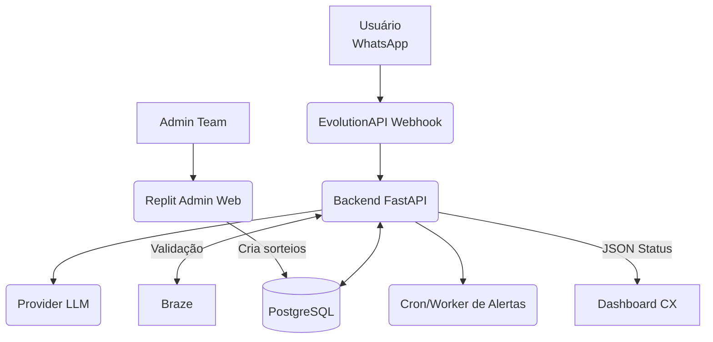

# Arquitetura de Alto Nível

## Responsabilidades
- **Replit Admin Web**: interface para criação/edição de sorteios; upload de PDFs; extração de regras via LLM; alimenta tabela `giveaways`
- **Backend (FastAPI)**: webhooks EvolutionAPI; etapa/estado; prompts para LLM; processamento de uploads; scheduler e auditoria; endpoints operacionais
- **EvolutionAPI**: transporte WhatsApp; envio de templates; marcação de conversa como não lida; webhook de mensagens/mídias
- **PostgreSQL**: `giveaways` (regras criadas pelo Replit), `sessions` (estado), `uploads` (mídias)
- **LLM**: respostas determinísticas com regras + snapshot
- **Braze**: validação de email ↔ sorteio ↔ número
- **Cron/Worker**: agendamentos de prazo e expiração
- **Dashboard CX**: leitura do snapshot `/sessions/{id}/status`

## Configurações e Segredos

### Replit Admin Web
- Postgres: DATABASE_URL (conexão compartilhada)
- LLM: PROVIDER, API_KEY (para extração de regras)

### Backend FastAPI
- EvolutionAPI: BASE_URL, TOKEN
- Postgres: DATABASE_URL (conexão compartilhada)
- Braze: API_URL, TOKEN
- LLM: PROVIDER, API_KEY, MODELO (gpt-4o), temp=0, top_p=0
